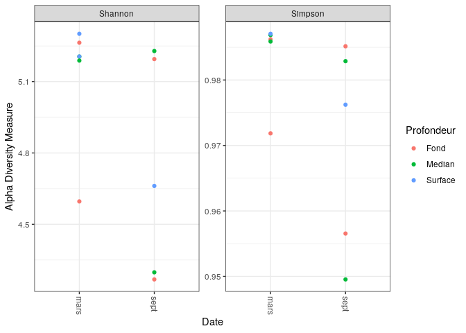
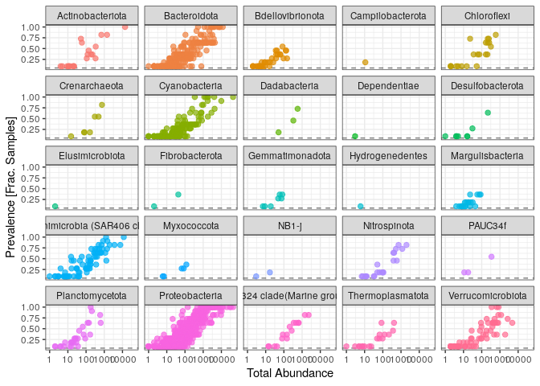
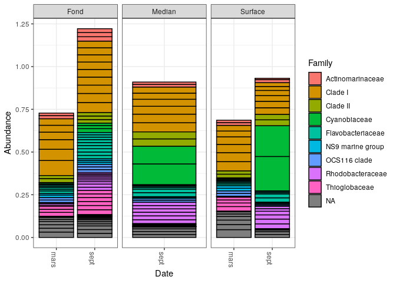
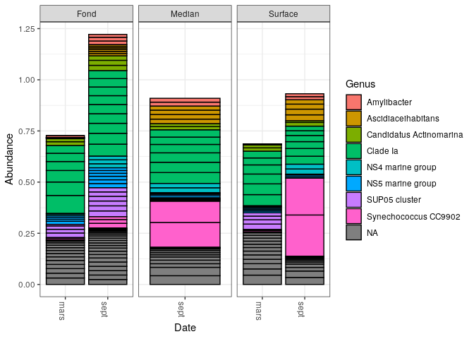
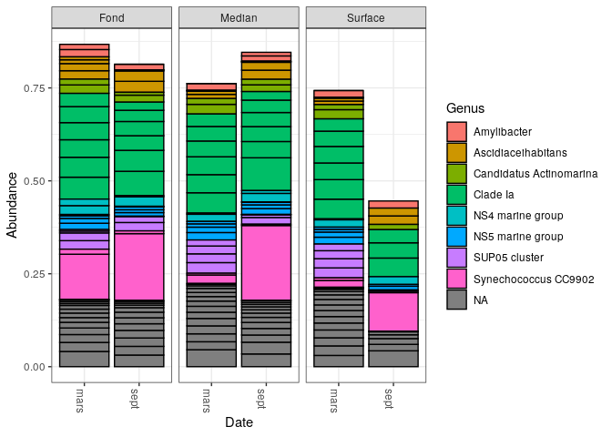

CC2 Écogénomique - Myriam FERBLANTIER - N°22000007
================

  - [Question 1 : Quelles sont les influences relative de la profondeur
    et de la saison sur la structure des communauté planctoniques de la
    rade de
    Brest](#question-1-quelles-sont-les-influences-relative-de-la-profondeur-et-de-la-saison-sur-la-structure-des-communauté-planctoniques-de-la-rade-de-brest)
  - [Question 2 : Quels sont les biomarqueurs de saison (hivers et été)
    ?](#question-2-quels-sont-les-biomarqueurs-de-saison-hivers-et-été)
  - [Bonus: Handoff to phyloseq](#bonus-handoff-to-phyloseq)
  - [Construire d’un simple échantillon de
    data.frame](#construire-dun-simple-échantillon-de-data.frame)
  - [Histogramme des abondances des familles de communautés
    bactériennes](#histogramme-des-abondances-des-familles-de-communautés-bactériennes)
  - [Histogramme des abondances des genres de communautés
    bactériennes](#histogramme-des-abondances-des-genres-de-communautés-bactériennes)

### Question 1 : Quelles sont les influences relative de la profondeur et de la saison sur la structure des communauté planctoniques de la rade de Brest

### Question 2 : Quels sont les biomarqueurs de saison (hivers et été) ?

## Bonus: Handoff to phyloseq

``` r
load("02_stat-analysiscc2-with-DADA2_FinalENV")
```

### Commentaire : ici on a lié les données de Dada2 dans le fichier 02\_stat-analysis pour effectuer la suite des analyses.

``` r
library(phyloseq)
```

``` r
library(Biostrings)
```

    ## Loading required package: BiocGenerics

    ## Loading required package: parallel

    ## 
    ## Attaching package: 'BiocGenerics'

    ## The following objects are masked from 'package:parallel':
    ## 
    ##     clusterApply, clusterApplyLB, clusterCall, clusterEvalQ,
    ##     clusterExport, clusterMap, parApply, parCapply, parLapply,
    ##     parLapplyLB, parRapply, parSapply, parSapplyLB

    ## The following objects are masked from 'package:stats':
    ## 
    ##     IQR, mad, sd, var, xtabs

    ## The following objects are masked from 'package:base':
    ## 
    ##     anyDuplicated, append, as.data.frame, basename, cbind, colnames,
    ##     dirname, do.call, duplicated, eval, evalq, Filter, Find, get, grep,
    ##     grepl, intersect, is.unsorted, lapply, Map, mapply, match, mget,
    ##     order, paste, pmax, pmax.int, pmin, pmin.int, Position, rank,
    ##     rbind, Reduce, rownames, sapply, setdiff, sort, table, tapply,
    ##     union, unique, unsplit, which, which.max, which.min

    ## Loading required package: S4Vectors

    ## Loading required package: stats4

    ## 
    ## Attaching package: 'S4Vectors'

    ## The following object is masked from 'package:base':
    ## 
    ##     expand.grid

    ## Loading required package: IRanges

    ## 
    ## Attaching package: 'IRanges'

    ## The following object is masked from 'package:phyloseq':
    ## 
    ##     distance

    ## Loading required package: XVector

    ## 
    ## Attaching package: 'Biostrings'

    ## The following object is masked from 'package:base':
    ## 
    ##     strsplit

``` r
library(ggplot2)
```

### Commentaire : Ici on a importé directement dans notre fichier Phyloseq, les tableaux produits par le pipeline Dada2 (dans le fichier précédent). Et la recharge de certains packages a été effectué pour la suite de l’analyse des réusltats.

``` r
theme_set(theme_bw())
```

### Commentaire : Ici on a utilisé la fonction theme\_bw(). Il s’agit de thèmes complets qui contrôlent tout l’affichage des données.

## Construire d’un simple échantillon de data.frame

``` r
samples.out <- rownames(seqtab.nochim)
profondeur <- sapply(strsplit(samples.out, "D"), `[`, 1)
date <- substr(profondeur,0,11)
samdf <- data.frame(Profondeur=profondeur, Date=date)
samdf$Profondeur[samdf$Date>11] <- c("Fond","Median","Surface")
```

    ## Warning in samdf$Profondeur[samdf$Date > 11] <- c("Fond", "Median", "Surface"):
    ## number of items to replace is not a multiple of replacement length

``` r
samdf$Date[samdf$Profondeur>11] <- c("mars","sept")
```

    ## Warning in samdf$Date[samdf$Profondeur > 11] <- c("mars", "sept"): number of
    ## items to replace is not a multiple of replacement length

``` r
rownames(samdf) <- samples.out
```

### Commentaire : Construction d’un échantillon data.frame à partir de nos données. Par exemple, la fonction data.frame() permet de créer des cadres de données en couplant des collections de variables qui partagent de nombreuses propriétés de matrices et de listes.

``` r
write.csv(samdf,"samdf.csv")
```

### Commentaire : Création d’un fichier csv., afin d’ordonner les différents paramètres (tels que les mois, et la profondeurd’échantillon).

``` r
samdf <-read.table('~/CC2/samdf.csv', sep=',', header=TRUE, row.names=1)
```

### Commentaire : Ici on a importé notre jeu de données qu’on a construit par la suite et on le met dans l’objet samdf. Ainsi, ce fichier regroupe différentes informations sur nos échantillons. Cela permet de les descriminer pour les critères mois et profondeur d’échantillon.

``` r
ps <- phyloseq(otu_table(seqtab.nochim, taxa_are_rows=FALSE), 
               sample_data(samdf), 
               tax_table(taxa))
ps
```

    ## phyloseq-class experiment-level object
    ## otu_table()   OTU Table:         [ 1522 taxa and 11 samples ]
    ## sample_data() Sample Data:       [ 11 samples by 2 sample variables ]
    ## tax_table()   Taxonomy Table:    [ 1522 taxa by 6 taxonomic ranks ]

### Commentaire : On regroupe dans un objet ps l’ensemble des objets (taxtab, samdf et seqtab) nous renseignant sur l’assignation taxonomique de chaque sequence et le nombre de sequence identifiés dans chacun des échantillons.

``` r
plot_richness(ps, x="Date", measures=c("Shannon", "Simpson"), color="Profondeur",)
```

<!-- -->
\#\#\# Commentaire : L’indice de Simpson et Shannon prennne en compte la
richesse et la régularité. En effet, ces deux indices permettent de
mesurer la diversité spécifique des nos échantillons. Plus l’indice de
Shannon et de Simpson sont élevés et plus on a une richesse importante
ou une diversité importante.Comme on peut le voir, les communauté
bactérienne sont plus diversifiés dans les fonds, en comparaison de la
partie médiane ou encore en surface.On peut voir en Hiver (mars), qu’il
y a une certaine répartition de la diversité en comparaison à l’Été
(septembre). Nous pouvons émettre l’hypothèse qu’il pourrait avoir une
potentielle corrélation de la diversité de la communauté bactérienne
avec les fonds marins (toujours en comparaison aux parties médiane et
surface).

``` r
rank_names(ps)
```

    ## [1] "Kingdom" "Phylum"  "Class"   "Order"   "Family"  "Genus"

### Commentaire : La fonction rank\_names() permet de déterminer plus facilement les rangs taxonomiques disponibles dans l’objet “ps” de classe phyloseq donné.

``` r
table(tax_table(ps)[, "Phylum"], exclude = NULL)
```

    ## 
    ##              Actinobacteriota                  Bacteroidota 
    ##                            21                           230 
    ##              Bdellovibrionota              Campilobacterota 
    ##                            34                             1 
    ##                   Chloroflexi                 Crenarchaeota 
    ##                            21                             7 
    ##                 Cyanobacteria                  Dadabacteria 
    ##                           148                             3 
    ##                  Dependentiae              Desulfobacterota 
    ##                             1                             8 
    ##               Elusimicrobiota                Fibrobacterota 
    ##                             1                             2 
    ##               Gemmatimonadota               Hydrogenedentes 
    ##                             7                             1 
    ##              Margulisbacteria Marinimicrobia (SAR406 clade) 
    ##                            20                            78 
    ##                   Myxococcota                         NB1-j 
    ##                             5                             2 
    ##                  Nitrospinota                       PAUC34f 
    ##                            21                             3 
    ##               Planctomycetota                Proteobacteria 
    ##                            29                           762 
    ##  SAR324 clade(Marine group B)              Thermoplasmatota 
    ##                            16                            18 
    ##             Verrucomicrobiota                          <NA> 
    ##                            71                            12

### Commentaire : La fonction tax\_table() permet de construire et accéder à une table de noms taxonomiques, organisée avec des rangs en colonnes. On peut faire un petit classement. On peut voir que les phyla Proteobacteria sont plus nombreux avec 762. Ensuite, en seconde place, les Bacteroidota présente 230. Et en troisième place, on peut voir également que les Cyanobacteria sont à 148.

``` r
ps <- subset_taxa(ps, !is.na(Phylum) & !Phylum %in% c("", "uncharacterized"))
```

### Commentaire : Il s’agit d’un emballage pratique autour de la fonction de sous-ensemble. Il est destiné à accélérer le sous-ensemble d’objets expérimentaux complexes avec un appel de fonction.

``` r
# Compute prevalence of each feature, store as data.frame
prevdf = apply(X = otu_table(ps),
               MARGIN = ifelse(taxa_are_rows(ps), yes = 1, no = 2),
               FUN = function(x){sum(x > 0)})
# Add taxonomy and total read counts to this data.frame
prevdf = data.frame(Prevalence = prevdf,
                    TotalAbundance = taxa_sums(ps),
                    tax_table(ps))
```

### Commentaire : Ici on a déterminé la prévalence de chaque caractéristique qui est stocké dans la data.frame. De plus, on a ajouté la taxonomie et le nombre total de lectures à ces données.

``` r
plyr::ddply(prevdf, "Phylum", function(df1){cbind(mean(df1$Prevalence),sum(df1$Prevalence))})
```

    ##                           Phylum        1    2
    ## 1               Actinobacteriota 3.904762   82
    ## 2                   Bacteroidota 4.065217  935
    ## 3               Bdellovibrionota 2.382353   81
    ## 4               Campilobacterota 2.000000    2
    ## 5                    Chloroflexi 4.190476   88
    ## 6                  Crenarchaeota 4.000000   28
    ## 7                  Cyanobacteria 3.141892  465
    ## 8                   Dadabacteria 5.000000   15
    ## 9                   Dependentiae 1.000000    1
    ## 10              Desulfobacterota 2.000000   16
    ## 11               Elusimicrobiota 1.000000    1
    ## 12                Fibrobacterota 2.500000    5
    ## 13               Gemmatimonadota 2.428571   17
    ## 14               Hydrogenedentes 1.000000    1
    ## 15              Margulisbacteria 1.900000   38
    ## 16 Marinimicrobia (SAR406 clade) 4.500000  351
    ## 17                   Myxococcota 2.400000   12
    ## 18                         NB1-j 1.500000    3
    ## 19                  Nitrospinota 3.761905   79
    ## 20                       PAUC34f 3.333333   10
    ## 21               Planctomycetota 3.620690  105
    ## 22                Proteobacteria 4.300525 3277
    ## 23  SAR324 clade(Marine group B) 4.687500   75
    ## 24              Thermoplasmatota 2.722222   49
    ## 25             Verrucomicrobiota 3.774648  268

### Commentaire : Plyr permet de séparer les différentes données (dont l’abondance et les phyla). On peut voir ici dans le tableau, l’estimation de chaque phyla. On peut voir que les phyla les plus abondants sont : Proteobacteria, Bacteroidota et Cyanobacteria, Marinimicrobia (SAR406 clade), Verrucomicrobiota. Ces derniers ont été classé selon le plus abondants au moins abondants. Cela confirme les résultats précédents.

``` r
# Subset to the remaining phyla
prevdf1 = subset(prevdf, Phylum %in% get_taxa_unique(ps, "Phylum"))
ggplot(prevdf1, aes(TotalAbundance, Prevalence / nsamples(ps),color=Phylum)) +
  # Include a guess for parameter
  geom_hline(yintercept = 0.05, alpha = 0.5, linetype = 2) +  geom_point(size = 2, alpha = 0.7) +
  scale_x_log10() +  xlab("Total Abundance") + ylab("Prevalence [Frac. Samples]") +
  facet_wrap(~Phylum) + theme(legend.position="none")
```

<!-- -->
\#\#\# Commentaire : Ici on a évaluer la prévalence de nos phyla sur
l’abondance total.En effet, nous voyons des résultats similaires aux
résultats précédents. On a toujours le classment : Proteobacteria,
Bacteroidota et Cyanobacteria, Marinimicrobia (SAR406 clade),
Verrucomicrobiota.

``` r
pslog <- transform_sample_counts(ps, function(x) log(1 + x))
out.wuf.log <- ordinate(pslog, method = "PCoA", distance = "bray")
```

### Commentaire : La fonction transform\_sample\_counts () permet de transformer les comptages d’échantillons d’une matrice d’abondance de taxons selon une fonction fournie.Les comptages de chaque échantillon sont transformés individuellement. Aucune interaction/comparaison échantillon-échantillon n’est possible par cette méthode.

### Commentaire : La fonction ordinate() englobe plusieurs méthodes d’ordination. En effet, le type d’ordination dépend de l’argument de la méthode. Ici on a utilisé comme méthode d’ordination, PCoA et Bray-Curtis.

### Répartition des communautés bactériennes en fonction des saisons et des profondeurs

``` r
evals <- out.wuf.log$values$Eigenvalues
plot_ordination(pslog, out.wuf.log, color = "Profondeur", shape="Date") + labs(col = "Profondeur",shape= "Date")
```

<!-- -->
\#\#\# Commentaire : Nous pouvons observer sur ce graphique différents
paramètres. En premier lieu, nous voyons différents formes de points qui
correspondent aux saisons. Septembre correspond à l’été et Mars
correspond à l’hiver. En second temps, nous pouvons voir différentes
couleurs qui correspondent à la profondeur (tels que la surface, la
médiane et le fond). L’axe 2 correspondrait à la distribution au sein
d’une même saison et l’axe 1 correspondrait à la distribution dans
entre les 2 saisons (dont l’été et l’hiver).

### Commentaire : Au niveau de l’axe 1, on peut qu’on a une certaine répartition des phyla au niveau des profondeurs. Par exemple, on peut voir que les phyla sont bien séparé selon les profondeurs. En -0.4 on a les phyla en surface, en -O,03 on a les phyla en médiane et en 0,05 on a les phyla en fond.

### Commentaire : Au niveau de l’axe 2, on peut voir que la répartition est un peu moins marqué au sein d’une même saison.

### Commentaire : Nous pouvons émettre l’hypothèse que la saison influerait plus sur la répartition des communautés bactériennes.

## Histogramme des abondances des familles de communautés bactériennes

``` r
top20 <- names(sort(taxa_sums(ps), decreasing=TRUE))[1:20]
ps.top20 <- transform_sample_counts(ps, function(OTU) OTU/sum(OTU))
ps.top20 <- prune_taxa(top20, ps.top20)
plot_bar(ps.top20, x="Date", fill="Family") + facet_wrap(~Profondeur, scales="free_x")
```

<!-- -->
\#\#\# Commentaire : Cette histogramme présente l’abondance des familles
de communautés bactériennes en fonction des profondeurs et des saisons
(septembre et mars). Les différentes familles correspondents aux
différents couleurs.

### Commentaire : Pour commencer, nous pouvons voir qu’il semblerait que la famille majoritaire (en terme d’abondance) serait la clade I pour les 2 saisons et pour les 3 différentes profondeurs. On peut voir également que la famille des Cyanobiaceaa est également majoritaire en été dans les profondeurs médiane et surface.

### Commentaire : Nous pouvons émèttre l’hypothèse, que la profondeur influerait sur la diversité et l’abondance des communautés bactériennes.

## Histogramme des abondances des genres de communautés bactériennes

``` r
top30 <- names(sort(taxa_sums(ps), decreasing=TRUE))[1:20]
ps.top30 <- transform_sample_counts(ps, function(OTU) OTU/sum(OTU))
ps.top30 <- prune_taxa(top30, ps.top30)
plot_bar(ps.top30, x="Date", fill="Genus") + facet_wrap(~Profondeur, scales="free_x")
```

<!-- -->
\#\#\# Commentaire : Cette histogramme présente l’abondance des genres
de communautés bactériennes en fonction des profondeurs et des saisons
(septembre et mars). Les différentes familles correspondents aux
différents couleurs.

### Commentaire : cette histogramme permet de préciser quel type de biomarqueurs qu’on pourrait utilisé dans les saisons. En effet, précédemment le même histogramme a été effectué avec les familles. Ici on a une précision qui est le genre. Donc un potentiel biomarqueurs pour les saisons.

### Commentaire : Pour commencer, nous pouvons voir qu’il semblerait que le genre majoritaire (en terme d’abondance) serait la clade la pour les 2 saisons et pour les 3 différentes profondeurs. On peut voir également que le genre des Synechococcus CC 9902 est également majoritaire en été dans les profondeurs médiane et surface.

### Commentaire : On peut observer également que l’abondance total des communautés bactériennes seraient plus important en septembre (été) en comparaison en mars (hiver).

### Commentaire : Nous pouvons utilisé comme biomarqueur de saison estivale le genre Synechococcus CC 9902. Au contraire, pour la saison hivernale, il est difficile d’obtenir un biomarqueurs intéressants, étant donné qu’on a une abondance assez répartie. On ne peut pas selectionner le genre Clade la, car il est également abondant en saison estivale.
